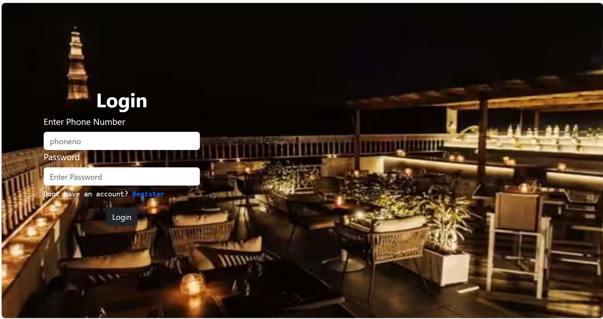

# Restaurant Website
A not very complicated restaurant management project with the following functinalities:
1) USER INTERFACE
   1. BROWSE MENU
   2. ADD ITEMS TO CART
   3. BOOK A TABLE

2) ADMIN INTERFACE
   1. DELETE FOOD ITEMS
   2. ADD FOOD ITEMS
   3. CONTROL ORDERS
   4. GET THE LIST OF TABLES BOOKED

# Images
## Login Page

## Admin Home page

## Adding Food Item Page for Admin

## Order list for Admin

## User Home Page

## User Cart

## Table Booking

